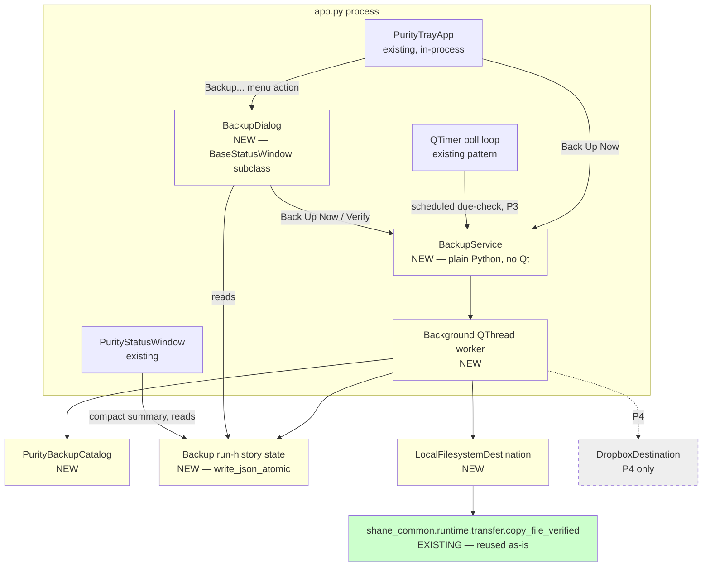

# Purity App Backup — Phase P0 Repository Audit

**Date:** 2026-09-15
**Status:** Audit complete — for review before P1
**Scope:** Read-only repository audit per
`2026-09-15_Purity_App_Local_and_Dropbox_Backup_Revised_Scaled_Down_Phased_Plan_v2_0.md`,
Phase P0 only. No production code was modified, no dependencies added, no
files moved.

---

## 1. Purity Persistence Inventory

Purity data currently lives under **three separate roots**, not one. This is
the single most important architectural finding of this audit and it drives
the backup catalog design.

```text
1. <data_root>                      configurable, default Path.home()/".purity"
                                     resolved at runtime via
                                     services.settings_schemas.resolve_purity_data_root()
2. <purity_app repo checkout>/data  hardcoded relative to source file location
                                     (TagLibrary, PanicReminders bundled default)
3. <purity_app repo checkout>/notes hardcoded relative to source file location
                                     (services.notes_setup._NOTES_ROOT)
4. %LOCALAPPDATA%\purity_app\settings.yaml
                                     SettingsManager preferences (shane_common.preferences)
```

`purity_app/` is itself a nested git repository (has its own `.git/`); its
`.gitignore` does **not** exclude `data/` or `notes/`, so live user data
(`tags.json`, `bible_library.json`, notes JSONL) currently sits inside a
source-controlled tree rather than a git-ignored user-data directory. This is
a pre-existing inconsistency, not something to fix in P0, but the backup
catalog must resolve real paths explicitly rather than assuming everything
is under `<data_root>`.

On the current dev machine, `resolve_purity_data_root()` appears configured
(via the local `settings.yaml`) to point at `purity_app/data`, which is why
`bible_library.json`/`tags.json`/`reminders.yaml` are visible directly in the
repo checkout. This is machine-specific configuration, not a guarantee — the
backup catalog must call `resolve_purity_data_root()` at runtime rather than
hardcode a path.

### Family-by-family detail

| Family | Source root/path | Format | Writer(s) | Reader(s) | Mutable while running | Atomic write | Safe to copy while running | Classification | Recommendation |
|---|---|---|---|---|---|---|---|---|---|
| **Notes** (general/purity, journal, Bible, Prayer) | `<repo>/purity_app/notes/PurityApp/default/{purity,journal,Bible,Prayer}.jsonl` (hardcoded in `services/notes_setup.py`, **not** `data_root`) | JSONL, append-only | `shane_common.notes.notes_writer.NotesWriter.commit()` — plain `open(path, "a")`, one line per commit, no fsync | `shane_common.notes.notes_repository.NotesRepository` (read-only index) | Yes — appended continuously from the GUI thread | No (plain append, not atomic-per-line) | Yes, with caveat: copy could land mid-line during an active append; window is a single `write()` call, low risk. Verified copy (hash compare + retry) handles this. | DURABLE / RESTORE-REQUIRED | INCLUDE |
| **Note correlations** | same dir, `note_correlations.jsonl` | JSONL, append-only | `NotesWriter.commit_correlation()` | `NotesRepository` | Rare | No | Yes (same caveat) | DURABLE | INCLUDE |
| **Bible library** (user-typed verse text) | `<data_root>/bible_library.json` | JSON, whole-file rewrite | `services/bible_library.py: BibleLibrary._save()` — **`Path.write_text()` directly, not `write_json_atomic`** | `BibleLibrary.load()`, `_VerseWidget`, `BibleBrowserDialog` | Yes, on verse save | **No** — not atomic; a copy mid-write could read a torn/partial file | DURABLE / RESTORE-REQUIRED | INCLUDE, but verified-copy hash mismatch should trigger a bounded retry (torn read is not source corruption) |
| **Bible memorizing list** | `<data_root>/bible_memorizing.json` | JSON | same `BibleLibrary` | same | Yes | No (same as above) | DURABLE | INCLUDE |
| **Prayer recipients** | `<data_root>/data/prayer_recipients.json` | JSON | `services/prayer_recipients.py: PrayerRecipientLibrary._save()` — uses `shane_common.io.atomic.write_json_atomic` | `PrayerRecipientLibrary.load()` | Yes | **Yes** (temp file + `os.replace`) | Yes | DURABLE / RESTORE-REQUIRED | INCLUDE |
| **Prayer "prayed this cycle" state** | `<data_root>/data/prayer_prayed.json` | JSON | same, `write_json_atomic` | same | Yes | Yes | Yes | OPTIONAL / REBUILDABLE (rotation state, not identity data) | INCLUDE (cheap, improves restore fidelity) |
| **Tag library** | `<repo>/purity_app/data/tags.json` (hardcoded in `services/tag_library.py`, **not** `data_root`) | JSON | `TagLibrary._save()` — `Path.write_text()` directly, **not atomic** | `TagLibrary.load()`, `_TagPickerPopup` | Yes, on new-tag add | No | Yes (small file, same torn-read caveat) | DURABLE / RESTORE-REQUIRED | INCLUDE — but the path is a hardcoded repo-relative location; the backup catalog must reference it explicitly, it will not be discovered by walking `data_root` |
| **Reminders override** | `<data_root>/reminders.yaml` (user override; falls back to bundled `<repo>/purity_app/data/reminders.yaml` if absent) | YAML | not user-editable from within the app (manual file edit) | `services/panic_reminders.py: PanicReminders` | Rarely | N/A | Yes | OPTIONAL / REBUILDABLE (only include if a user override actually exists; the bundled default ships with the repo) | INCLUDE if present at `<data_root>/reminders.yaml`; do not back up the bundled repo copy |
| **Guided check-ins** ("check-ins" per the plan) | **none — in-memory only** | n/a | `services/fake_journal.py: FakeJournalService` | `_DashboardJournalPanel._save_guided()` appends to the in-memory service only; **no `NotesWriter.commit()` call exists in `_save_guided`** | Entire history is lost on every restart | n/a | n/a | TRANSIENT (currently) | **EXCLUDE / BLOCKER** — see §18. There is currently nothing durable to back up for guided check-ins; this is a pre-existing product gap, not a P0 defect |
| **Free-form journal entries** | Persisted indirectly as **Notes** with `owner="journal"` (see Notes row above), *not* as `JournalEntry`/`FakeJournalService` state | JSONL | `_FreeJournalWidget._save_free()` → `journal_notes_writer.commit()` | `NotesRepository` | Yes | No (plain append) | Yes | DURABLE (via Notes) | Already covered by the Notes family above — no separate catalog entry needed |
| **System event journal** (`system.start`, `pulse.*`, `panic.*` structured events) | `<data_root>/_system/purity/journals/<YYYY-MM-DD>/<stream>.jsonl` | JSONL | `shane_common.journaling.service.JournalService` via `services/journaling_profile.py` | log viewer, review tooling | Yes, continuously | Sink-dependent (`JsonlJournalSink`, append-based) | Yes (same append caveat) | OPTIONAL / REBUILDABLE — operational/diagnostic telemetry, not user content required for "restore my Bible notes/prayer list" | EXCLUDE from the initial (P1) catalog; revisit only if diagnostics-replay becomes a requirement |
| **Pulse cadence state** | `<data_root>/_system/purity/pulse/days/<day>.json` | JSON via `shane_common.config.json_config.JsonConfigStore` | `services/pulse_store.py: PulseStore` | pulse manager | Yes | Store-dependent (JsonConfigStore not audited further — behavioral state, not content) | Presumed yes | OPTIONAL / REBUILDABLE (cadence/reminder bookkeeping, regenerates naturally) | EXCLUDE from P1; low priority |
| **Panic reason stats** | `<data_root>/data/panic/reason_counts.json` | JSON | `services/panic_stats.py` — `write_json_atomic` | panic UI | Yes | Yes | Yes | OPTIONAL / REBUILDABLE | EXCLUDE from P1 (small, non-critical) |
| **URL history** | `<data_root>/data/url_history.json` | JSON | `services/url_history.py` — `write_json_atomic` | web watcher | Yes | Yes | Yes | TRANSIENT / privacy-sensitive browsing history | EXCLUDE |
| **Heartbeats** (`purity_app`, `purity_supervisor`, `purity_tray`) | `<data_root>/_system/purity/heartbeats/` | JSON | `shane_common.watchdog.heartbeat_writer.HeartbeatWriter` | `HeartbeatReader` | Continuously (every few seconds) | Presumed atomic (not required for correctness — liveness only) | N/A | SYSTEM / WATCHDOG | EXCLUDE |
| **Watchdog audit log** | `<data_root>/_system/purity/audit/purity.audit.jsonl` | JSONL | `AppendOnlyAuditLog` via `PuritySupervisorClient` | `PurityStatusWindow` | Continuously | Append | N/A | SYSTEM / WATCHDOG | EXCLUDE |
| **Supervisor debug/startup logs** | `<data_root>/_system/purity/{supervisor_debug,startup_debug}.log` | plain text | `supervisor.py`, `app.py` `_log_supervisor`/`_append_startup_log` | humans | Continuously | Append | N/A | SYSTEM / DIAGNOSTIC | EXCLUDE |
| **User preferences** | `%LOCALAPPDATA%\purity_app\settings.yaml` | YAML | `shane_common.preferences.manager.SettingsManager` — `write_text_atomic` | app-wide | Occasionally | Yes | Yes | DURABLE but small/config, not "content" | OPTIONAL — include in P1 catalog for restore convenience (recreates `data_root` override, permitted browsers, telegram config, pulse settings); low effort since it is one small file |
| **Tray/status window UI prefs** (panic button visibility, window geometry) | Windows registry via `QSettings(org="purity", app="PurityMonitor" / "PurityStatusWindow")` | registry, not filesystem | `BaseTrayApp._save_prefs`, `BaseStatusWindow.save_geometry_prefs` | same | Occasionally | N/A (registry) | N/A | SYSTEM / cosmetic | EXCLUDE — out of scope for a filesystem-based backup; not restore-critical |

### Restore-required backup source catalog (P1 candidate set)

```text
INCLUDE (Phase P1 catalog):
  1. Notes:            <repo>/purity_app/notes/PurityApp/default/*.jsonl
  2. Bible library:     <data_root>/bible_library.json
  3. Bible memorizing:  <data_root>/bible_memorizing.json
  4. Prayer recipients: <data_root>/data/prayer_recipients.json
  5. Prayer prayed:     <data_root>/data/prayer_prayed.json
  6. Tag library:       <repo>/purity_app/data/tags.json
  7. Reminders override:<data_root>/reminders.yaml            (only if present)
  8. User preferences:  %LOCALAPPDATA%\purity_app\settings.yaml (optional, low-effort)

EXCLUDE / not in P1:
  - Guided check-ins (no durable store exists yet — product gap, see §18)
  - System event journal, pulse cadence state, panic stats, url history
  - Heartbeats, watchdog audit log, debug logs
  - QSettings registry entries (window geometry, panic button visibility)
```

---

## 2. Recommended Backup Execution Owner

Two distinct processes currently exist and must not be confused:

```text
app.py (purity_app)
    long-lived QApplication, already hosts:
      - QTimer-driven pulse manager / web watcher / browser session polling
      - PurityTrayApp (tray icon) instantiated in-process at app.py:1562
      - PurityStatusWindow
    This is the process the user actually runs all day.

supervisor.py (purity_supervisor)
    SEPARATE, independently launched watchdog process (spawned by app.py /
    Task Scheduler). Its only job is: read purity_app's heartbeat, show a
    "Purity App Down" dialog, optionally relaunch it. Minimal QTimer poll
    every 5s. It does not host any business logic today.
```

**Finding:** `PurityTrayApp` already runs inside the **main `app.py`
process**, not inside `supervisor.py`. The plan's "Supervisor" (background
execution/scheduling host) should therefore be **`app.py`'s own process**,
not `supervisor.py`. `supervisor.py` is a crash-detection watchdog and should
remain that — it must not gain backup/copy/hash/Dropbox responsibilities,
both because that would blur its single responsibility and because it is not
guaranteed to be running whenever `app.py` is (it can be killed/relaunched
independently, and its whole purpose is to detect `app.py` being down).

Recommended:

```text
app.py process (already the long-lived, already-Qt-event-loop host)
    -> BackupService (plain Python class, no Qt dependency)
         called from a QTimer tick (schedule due-check) and/or
         a direct "Back Up Now" request from PurityTrayApp
    -> heavy work (copy/hash/Dropbox) executed on a background QThread /
       worker, never on the GUI thread — nothing in the current codebase
       already does this for CPU/IO-heavy work, so this is new but small
       (QThread + signal back to the tray/dialog is standard PySide6 usage)
```

Supervisor-audit answers:

1. **Lifetime/restart model** — `app.py` restarts only if killed/relaunched
   by the user or by `supervisor.py`'s relaunch button; `supervisor.py` is
   a separate always-on watchdog. Backup scheduling should live in `app.py`
   since that is the process actually editing the user's data.
2. **Already does scheduled/background work?** — Yes: pulse manager, web
   watcher, browser-session heartbeat polling already run via `QTimer` in
   `app.py`. A backup schedule tick fits the same pattern.
3. **Timers/event-loop** — `QTimer` is already the established mechanism.
4. **IPC tray → owner** — None needed; `PurityTrayApp` and the backup logic
   would live in the same process (in-process call), unlike the
   tray↔supervisor.py relationship which is heartbeat-file-based because
   they are different processes.
5. **Shutdown behavior** — `app.py` has an existing `aboutToQuit`/exit-marker
   path; a backup run should be interruption-safe (the `copy_file_verified`
   primitive already guarantees this — see §7) rather than requiring
   graceful-shutdown coordination.
6. **Single-instance** — `app.py` already enforces a named-mutex singleton
   (`_SINGLETON_MUTEX_NAME`); no separate backup-process singleton is
   needed if backup logic lives in-process.
7. **Persistent state location** — should follow the existing convention:
   `<data_root>/_system/purity/backup/` (parallel to `heartbeats/`,
   `audit/`, `pulse/`).
8. **Error isolation** — must not raise into the Qt event loop; every
   handler must report via traceback (per repo convention — see
   `_report()` patterns in `shane_common.watchdog.*`) and never crash the
   app on a failed backup.
9. **Could heavy work block watchdog duties?** — Only if run on the GUI
   thread; `app.py`'s own heartbeat writer runs on its own daemon thread
   already (`HeartbeatWriter.start()`), so a backup run on the GUI thread
   would still let the heartbeat keep beating, but would freeze the UI.
   Conclusion: **run backup copy/hash/Dropbox work off the GUI thread.**
10. **Dedicated `BackupService`?** — Yes, consistent with the plan and with
    how `PuritySupervisorClient` already wraps generic watchdog primitives
    for Purity-specific use — `BackupService` should be the Purity-specific
    orchestration layer over the generic `shane_common` primitives found in
    §7, not a copy/hash/Dropbox reimplementation.

`supervisor.py` should not change in P1/P2 at all.

---

## 3. Tray / Status Integration Recommendation

Current tray menu (from `ui/system/supervisor_tray.py`, built in `app.py`):

```text
Show Purity
Show Status
Reload            (if reload_fn provided)
Show Panic Button  (checkable)
---------------
Quit               (appended by BaseTrayApp.start())
```

Recommended (matches the plan's target, minimal insertion point identified):

```text
Show Purity
Show Status
Backup...          <- new QAction, added the same way "Reload"/"Show Panic
                      Button" already are, right before the separator
Reload
Show Panic Button
---------------
Quit
```

`PurityStatusWindow._build_content` / `.refresh()` already follow a clear,
copyable pattern (label + `setStyleSheet` color coding) for adding a third
compact "backup summary" block (LOCAL / DROPBOX / last success / next run)
without restructuring the existing window.

A new, separate `BackupDialog(BaseStatusWindow)` (or plain `QDialog`) should
be added under `purity_app/ui/backup/backup_dialog.py`, following the same
inheritance pattern `PurityStatusWindow(BaseStatusWindow)` already uses. The
dialog must call only `BackupController`/`BackupService` methods — no direct
`shutil`/`hashlib`/network calls in Qt code, mirroring how `_DashboardPrayerCard`
and `_FreeJournalWidget` already delegate all persistence to
service/writer objects rather than touching files directly.

---

## 4. Reusable `shane_common` Infrastructure

| Mechanism | Module/path | Public API | Reusable as-is? | Notes |
|---|---|---|---|---|
| **Copy + SHA-256 verify** | `shane_common.runtime.transfer.copy` | `copy_file_verified(source, destination) -> CopyVerifyResult` (`CopyOutcome`: COPIED / ALREADY_PRESENT_IDENTICAL / DESTINATION_CONFLICT / SOURCE_CHANGED_DURING_COPY) | **Yes, directly.** This already implements exactly the plan's P1 "copy → verify size → SHA-256 source → SHA-256 destination → compare" requirement, including source-change detection during copy and destination-conflict fail-closed behavior. | This is the single most valuable existing primitive for this feature. No enhancement needed for local-disk backup. |
| **SHA-256 file hash** | `shane_common.runtime.transfer.hashing` | `sha256_file(path, chunk_size=...) -> str` | Yes | Used internally by `copy_file_verified`; can be reused standalone for `Verify` action. |
| **Configured storage profile** | `shane_common.runtime.storage.profile` | `StorageProfile(profile_id, backend_type, root, durable, cacheable)` | Yes, for the **local destination** side (`backend_type="filesystem"` is the only supported backend today). | Good fit for "configured secondary local drive". Does **not** support Dropbox as a backend — see gap below. |
| **Semantic storage registry** | `shane_common.runtime.storage.registry` | `StorageRegistry(profiles=..., resources=...)`, `.resolve(resource_id, **params) -> StorageLocation`, `.resolve_path(...)`, `.required_parameters(...)` | Yes, optional | Could model the backup destination as a registered `StorageProfile`/resource, but this is heavier machinery than Purity strictly needs for one configurable destination path; a plain `Path` setting may be simpler. Recommend evaluating during P1 design, not assuming it must be used. |
| **Atomic JSON/text write** | `shane_common.io.atomic` | `write_json_atomic(path, data)`, `write_text_atomic(path, text)` | Yes | Use for all new backup state files (run history, schedule state) — same pattern `PrayerRecipientLibrary`/`panic_stats.py` already use, and the pattern the *new* `BibleLibrary`/`TagLibrary` writes should arguably also adopt (existing bug, out of scope to fix here). |
| **Append-only audit log** | `shane_common.watchdog.audit.AppendOnlyAuditLog` | `.append(record)`, `.tail(n)` | Yes | Directly reusable for a backup run history/audit trail, exactly as `PuritySupervisorClient` already uses it for watchdog events. |
| **Generic tray scaffold** | `shane_common.watchdog.tray.base_tray_app.BaseTrayApp` | subclass hook `_poll()`, `_audit_log`, `_app_id` | Already in use by `PurityTrayApp`; no change needed, only add a new menu action + handler. |
| **Generic status window scaffold** | `shane_common.watchdog.tray.base_window.BaseStatusWindow` | `_build_content(container)`, `show_and_raise()`, geometry persistence | Yes, for the new Backup dialog. |
| **Heartbeat reader/writer** | `shane_common.watchdog.heartbeat_reader/writer` | n/a | Not applicable to backup — liveness only. |
| **Process launcher** | `shane_common.watchdog.process_launcher.ProcessLauncher` | rate-limited detached spawn | Not needed — no new process is being created. |
| **Generic single-flight/file lock** | *(none found)* | — | **Gap.** No generic mutex/lock-file primitive exists in `shane_common`. `WatchdogStateStore`/`BaseLockState` model a *lock state record*, not an actual concurrency mutex. | See §8 (missing primitives). |
| **Generic schedule/due-occurrence evaluation** | *(none found in `shane_common`)* | — | **Gap.** Due-occurrence/schedule logic currently exists only in `trading_system.storage.archive_maintenance.schedule` (trading-specific package, not importable from `purity_app` without a cross-domain dependency). | See §8. |
| **Credential/secret storage helper** | *(none found)* | — | **Gap.** No `keyring`/DPAPI wrapper exists anywhere in `shane_common`. | See §8, §11. |
| **Dropbox/cloud abstraction** | *(none found)* | — | **Gap**, expected — plan explicitly defers Dropbox to P4. | See §11. |

Nothing in `purity_app` should reimplement copy-verify or SHA-256 hashing —
`shane_common.runtime.transfer` already covers this and has no
trading-specific coupling (confirmed: no imports of `trading_system` or
`system_console` in `copy.py`/`hashing.py`).

---

## 5. Missing Generic Primitives (Gaps)

1. **Single-flight execution lock** — needed so a manual "Back Up Now" click
   and a scheduled tick can never run concurrently. Trading's
   `archive_maintenance/lock.py` (stale-lock reclaim, machine-local) is
   usable *prior art* but is trading_system-local and must not be imported
   by `purity_app`. Recommend either (a) a small Purity-local lock module
   modeled on the same idea, or (b) if a second consumer appears, promote a
   generic version into `shane_common.watchdog` (parallel to
   `WatchdogStateStore`). Do not decide this in P0 — flag as a P1 design
   choice.
2. **Schedule/due-occurrence evaluation** — same situation as above:
   trading's `archive_maintenance/schedule.py` is proven prior art (explicit
   timezone, DST-safe due/next-run computation) but is not reusable directly
   from `purity_app`. A "Sunday at HH:MM" schedule is a much smaller problem
   than trading's daily-job scheduler; a small Purity-local implementation
   is likely sufficient for P3 and does not obviously warrant promotion to
   `shane_common` yet.
3. **Credential storage** — Dropbox will require an OAuth refresh token (or
   equivalent) stored outside source control and outside plaintext
   `settings.yaml`. No existing helper exists anywhere in this workspace.
   This is a **blocker to resolve before P4** (see §11), not P0/P1/P2/P3.

---

## 6. Proposed Package/Module Placement

Following the plan's §14 recommendation and existing Purity conventions
(`services/*.py` for domain services, `ui/*` for Qt-only presentation):

```text
purity_app/
    services/
        backup/
            catalog.py       # PurityBackupCatalog — resolves the family list in §1
            models.py        # BackupRunResult, FamilyResult, DestinationState, enums
            service.py       # BackupService — orchestrates catalog + copy_file_verified
            state.py         # durable run-history state (write_json_atomic)
            scheduler.py     # P3 — Sunday due-occurrence check (Purity-local, small)
            destinations/
                local.py      # LocalFilesystemDestination
                dropbox.py    # P4 only — not created in P1/P2
    ui/
        backup/
            backup_dialog.py  # BackupDialog(BaseStatusWindow) — presentation only
```

This keeps `shane_common` untouched in P1/P2 and matches the existing
`services/*_recipients.py`, `services/tag_library.py`,
`services/notes_setup.py` placement style already used for Purity-specific
persistence services.

---

## 7. Local Backup Destination Configuration

Recommend a single new setting in the existing
`services/settings_schemas.py` `app.general` (or a new `app.backup`)
category, following the exact pattern already used for `data_root`:

```python
SettingDefinition(
    key="backup_local_destination",
    type="str",
    default="",
    label="Local Backup Destination",
    description="Secondary drive/folder for verified Purity backups.",
)
```

This reuses `shane_common.preferences.SettingsManager` — no new
configuration mechanism needed. Missing/unavailable destination should fail
visibly (per plan §8 acceptance), consistent with how `resolve_purity_data_root`
already fails open/reports rather than silently defaulting.

---

## 8. Dropbox Integration Approach (P4 — design-only, not implemented here)

No Dropbox SDK or abstraction exists in this workspace today (confirmed by
search — no `dropbox` references anywhere in `shane_common` or `purity_app`).
P4 will require:

- adding the `dropbox` Python package as a **new dependency** (explicitly
  out of scope for P0 — flagged as a decision for P4, not approved here);
- an OAuth app registration (external, human action);
- a `DropboxDestination` class living beside `LocalFilesystemDestination`
  behind a shared `BackupDestination` interface, per the plan's §11 model;
- content/revision-hash verification via Dropbox's own metadata rather than
  assuming local SHA-256 semantics transfer unchanged (Dropbox exposes a
  content hash algorithm that differs from plain SHA-256 — must be handled
  distinctly from local disk verification, not shoehorned into
  `copy_file_verified`).

No further Dropbox design is produced in this P0 audit; this section exists
only to record the finding that no reusable groundwork currently exists.

---

## 9. Credential Storage Recommendation

No existing mechanism in this repo is suitable for storing a Dropbox
refresh token:

- `%LOCALAPPDATA%\purity_app\settings.yaml` is **plaintext YAML** — not
  acceptable for a secret.
- `QSettings` (Windows registry) is also not encrypted at rest.

Recommended direction for P4 (decision, not implementation): Windows
Credential Manager via the `keyring` package (a **new dependency**, requires
explicit approval), or Windows DPAPI directly via `ctypes` (no new
dependency, more code). This must be decided before P4 begins; it is
**not** a P0/P1/P2/P3 blocker.

---

## 10. Schedule Ownership / Design

- **Owner:** `app.py`'s existing QTimer-driven poll loop (same process as
  the pulse manager/web watcher), per §2.
- **Design (P3):** a small Purity-local due-occurrence check — "has the
  configured weekday/time passed since the last recorded successful (or
  attempted) run" — persisted the same way `PulseStore`/`panic_stats.py`
  already persist small JSON state (`write_json_atomic`). This is
  deliberately smaller than trading's daily-job scheduler; no generic
  `shane_common` scheduler is required for a single weekly occurrence.
- Manual "Back Up Now" and the scheduled tick must go through the same
  `BackupService` entry point and the same lock (see §5.1) so they can never
  double-run.

---

## 11. Concurrency / Error-Isolation Considerations

- Backup copy/hash/Dropbox work must run off the Qt GUI thread (no existing
  Purity code currently does heavy work in a background `QThread` — this
  will be a new but standard pattern).
- A single-flight lock (§5.1) must guard `BackupService.run()` so overlapping
  manual + scheduled triggers cannot interleave.
- Every exception boundary must report via traceback (repo-wide convention;
  see `_report()` in `shane_common.watchdog.*` and the bare `except Exception:
  traceback.print_exc()` pattern already used in `bible_library.py`,
  `prayer_recipients.py`) — never a silent `except Exception: pass`.
- Local and Dropbox destination state must be persisted independently (per
  plan §6) — a Dropbox failure must not overwrite or invalidate a verified
  local backup's recorded state, and vice versa.
- A failed/blocked backup must never affect `app.py`'s own heartbeat or the
  watchdog's view of app health — these are already fully independent
  subsystems (`HeartbeatWriter` runs on its own daemon thread), so this is
  a design constraint to preserve, not a new mechanism to build.

---

## 12. Proposed Test Strategy

Follow the existing repo convention (`purity_app/tests/test_prayer_recipients.py`
constructs the real class against `tmp_path`, no mocking of the filesystem
layer):

```text
tests/backup/test_catalog.py       — catalog resolves expected paths against tmp_path fixtures
tests/backup/test_service.py       — BackupService against tmp_path source/dest roots,
                                      using the real copy_file_verified primitive
tests/backup/test_state.py         — run-history persistence / idempotent retry
tests/backup/test_lock.py          — single-flight behavior (manual + scheduled overlap)
tests/backup/test_scheduler.py     — due-occurrence computation (P3)
```

No GUI smoke test is strictly required for P1 (no dialog exists yet); P2
should add a real-`QApplication` widget test for `BackupDialog`, mirroring
the pattern already used for other Purity dialogs (`NoteDialog`,
`BibleBrowserDialog`) and the trading `archive_maintenance` GUI's own
real-`QApplication` smoke tests (non-governing prior art, confirms the
pattern is viable in this codebase's toolchain).

---

## 13. Recommended Architecture (diagram)



Green = existing, reused as-is. Yellow = new Purity-local code (P1/P2).
Dashed/gray = explicitly deferred to P4.

---

## 14. Exact Files Likely to Change in Phase P1/P2

**New files (P1):**
```text
purity_app/services/backup/__init__.py
purity_app/services/backup/catalog.py
purity_app/services/backup/models.py
purity_app/services/backup/service.py
purity_app/services/backup/state.py
purity_app/services/backup/destinations/__init__.py
purity_app/services/backup/destinations/local.py
purity_app/tests/backup/test_catalog.py
purity_app/tests/backup/test_service.py
purity_app/tests/backup/test_state.py
```

**Modified files (P1, minor):**
```text
purity_app/services/settings_schemas.py   — add backup_local_destination setting
```

**New files (P2):**
```text
purity_app/ui/backup/backup_dialog.py
purity_app/services/backup/lock.py         (or reuse a promoted shane_common primitive)
```

**Modified files (P2, minor):**
```text
purity_app/ui/system/supervisor_tray.py   — add "Backup..." QAction + handler,
                                             add compact backup summary to
                                             PurityStatusWindow.refresh()
purity_app/app.py                          — instantiate BackupService and wire
                                             the tray's Back Up Now callback
                                             (same place PurityTrayApp is
                                             already constructed, ~line 1562)
```

`supervisor.py` is **not** expected to change in any phase per this audit's
recommendation (§2).

---

## 15. Blockers / Unresolved Decisions

1. **Guided check-ins have no durable store today.** `_save_guided()` only
   appends to the in-memory `FakeJournalService`; there is nothing on disk
   to back up for this family. Before P1 claims "check-ins" as
   backed-up/restore-capable, a product decision is needed: either (a) wire
   guided check-ins through `NotesWriter` the same way free journal entries
   already are (small, consistent fix, but it is a product/behavior change
   outside this backup task's stated scope), or (b) explicitly document
   check-ins as not currently persisted and exclude them from the backup's
   restore guarantees. **This audit recommends (b) for P1, with a follow-up
   ticket for (a) tracked separately** — implementing (a) would be a
   feature change to `left_dock_dashboard.py`, not a backup-phase task.
2. **`TagLibrary` and `NotesWriter`/`shane_common.notes` write outside
   `data_root`** (hardcoded relative to the repo checkout). The backup
   catalog must hardcode these two paths explicitly; they will not be
   discovered by any generic "walk `data_root`" approach. This is safe to
   work around in the catalog but is a latent packaging/deployment risk
   (if `purity_app` is ever run from a read-only or different checkout
   location, tags/notes would silently write to the wrong place). Not a
   P0 fix; flagged for awareness.
3. **`BibleLibrary._save()` and `TagLibrary._save()` are not atomic writes**
   (plain `Path.write_text()`, not `write_json_atomic`). Low risk given
   file size and write frequency, but means a backup copy taken at the
   exact moment of a save could observe a torn file. `copy_file_verified`'s
   hash comparison will correctly detect this as a mismatch/retry case
   rather than silently accepting corrupt data — no new code is required
   to handle this safely, but a single retry-on-mismatch policy should be
   part of `BackupService`, not assumed away.
4. **No single-flight lock or schedule/due-occurrence primitive exists in
   `shane_common` today** (§5). P1 does not need either (no scheduling in
   P1); P2's lock and P3's scheduler need a decision on
   Purity-local-vs-promote-to-shane_common before those phases begin — this
   audit recommends starting Purity-local and only promoting later if a
   second consumer appears, consistent with the plan's §16 ownership rule.
5. **Credential storage for Dropbox is unresolved** (§9) — must be decided
   before P4, not before P1.
6. **Whether `StorageRegistry`/`StorageProfile` should be used to model the
   local backup destination**, versus a single plain path setting (§7).
   This audit did not force a decision; recommend deciding during P1 design
   based on whether more than one local destination profile is ever likely
   (unlikely for a single-user desktop app) — leaning toward the simpler
   plain-path setting unless a concrete reason to use the registry emerges.

---

## 16. Summary Recommendation

```text
Execution owner:     app.py's existing QApplication process (NOT supervisor.py)
Heavy work location: background QThread worker inside app.py, never the GUI thread
Tray integration:    add "Backup..." action to the existing PurityTrayApp menu
Status integration:  compact LOCAL/DROPBOX/last-success/next-run block in
                     the existing PurityStatusWindow
New dialog:          BackupDialog(BaseStatusWindow), presentation-only
Core copy mechanism: shane_common.runtime.transfer.copy_file_verified — reuse as-is
Storage config:      shane_common.runtime.storage (StorageProfile/StorageRegistry) —
                     optional, evaluate in P1 design; a plain settings path may suffice
Atomic state:        shane_common.io.atomic.write_json_atomic — reuse as-is
Audit trail:         shane_common.watchdog.audit.AppendOnlyAuditLog — reuse as-is
Missing generics:    single-flight lock, schedule/due-occurrence, credential storage —
                     build Purity-local for now; do not promote to shane_common yet
supervisor.py:       unchanged in all phases
```

No production code has been modified. Ready for review before Phase P1
begins.
