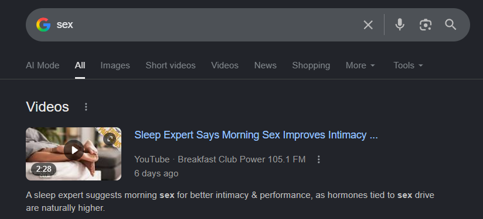

# 2026-06-04 Chat Snippets: Chrome Extension Text Monitoring

Minimum recommended chats: 2.

Why 2 chats:
- Chat 1 covers the entire classifier core: `classifier.js`, `service_worker.js`, and `config/monitored_phrases.json`. These have no Chrome DOM dependencies and can be loaded, inspected, and mentally verified in isolation before any page-touching code exists.
- Chat 2 wires everything into the browser: `overlay.js`, `content.js`, and the two file updates (`background.js`, `manifest.json`). All of these depend on Chat 1's files existing. They are done together because manifest.json must reference content scripts that already exist, and background.js must `importScripts` modules that are already written.

---

## Chat 1 — Classifier core: phrases config, classifier, service worker module

Paste this into a new chat:

```text
Implement Phase 1 from [docs/TODO/2026-06-04_text_monitoring_plan.md](docs/TODO/2026-06-04_text_monitoring_plan.md).

Create these three files in `browser_extension/`:
- `config/monitored_phrases.json`
- `classifier.js`
- `service_worker.js`

Constraints:
- `classifier.js` must have zero Chrome API calls — pure JS functions only. It will be loaded via `importScripts()` in the service worker, but it must also be node-testable.
- Include all extension point comments listed in the plan (FUTURE: regex, phrase groups, native messaging, AI model).
- `service_worker.js` must cache `phraseConfig` in memory and fall back to a small hardcoded `EMERGENCY_DEFAULTS` object (hard_block only: "porn", "pornography", "onlyfans") if the JSON fetch fails. Log a console.warn on fallback.
- `service_worker.js` must expose a single `handleClassifyMessage(request, sendResponse)` function. Nothing else should be called from outside.
- `config/monitored_phrases.json` must include all seed phrases from the plan (11 hard_block, 11 soft_risk entries).
- Do not create or modify manifest.json, background.js, content.js, or overlay.js in this chat.

Validation:
- In the Extensions SW DevTools console, verify `importScripts('classifier.js', 'service_worker.js')` can be pasted and runs without errors.
- Manually call `classify("i want to watch porn", phraseConfig)` in the console and confirm it returns `{level: "HARD_BLOCK", score: 100, ...}`.
- Manually call `classify("feeling lonely tonight", phraseConfig)` and confirm `SOFT_RISK`.
- Manually call `classify("weather forecast tomorrow", phraseConfig)` and confirm `SAFE`.
- Confirm that deleting/renaming the JSON and reloading the SW causes the emergency fallback message to appear in the SW console.
- Provide a concise summary of what was created and any design decisions made.
```

---

## Chat 2 — Chrome integration: overlay, content script, background wiring, manifest

Paste this into a new chat after Chat 1 is complete:

```text
Implement Phase 2 from [docs/TODO/2026-06-04_text_monitoring_plan.md](docs/TODO/2026-06-04_text_monitoring_plan.md).

Chat 1 already created `classifier.js`, `service_worker.js`, and `config/monitored_phrases.json`.
Read those files before writing any new code.
Also read the existing `background.js` and `manifest.json` carefully — both are modified here, not replaced.

Create these two new files in `browser_extension/`:
- `overlay.js`
- `content.js`

Modify these two existing files:
- `background.js` — add `importScripts` at top, add `'classify'` case in the existing message listener, add `logDetection()` function
- `manifest.json` — add `content_scripts` entry, extend `web_accessible_resources[0].resources` to include `"config/monitored_phrases.json"`

Constraints:
- `overlay.js` must inject its CSS only once (guard with a module-level flag). Use `purity-overlay-*` class prefix throughout. `position: fixed`, `z-index: 2147483647`. Visual theme: soft-risk uses `#8b4513` (matches `google_images_warning.html`), hard-block uses `#8b0000`. Include Phil 4:8 quote in the overlay card body.
- `overlay.js` must expose `window.PurityApp = {}` with `showSoftRisk`, `showHardBlock`, `removeOverlay`, and `onHardBlock = null`. No other globals.
- `content.js` MutationObserver must guard against double-attaching listeners using a `dataset` flag on the element.
- `content.js` must skip classification for text shorter than 3 characters.
- `content.js` form/Enter interception must attach at most once per element (guard with dataset flag).
- `background.js` changes must be minimal: `importScripts` line at top, one new `case 'classify'` branch in the existing message switch/if-else, and the new `logDetection()` function. Do not restructure or reformat the existing file.
- `logDetection()` must reuse the existing `getInstanceId()` helper and must be fire-and-forget (try/catch, silent failure).
- `manifest.json` — add `content_scripts` as a new top-level key. Do not alter any existing keys.

Validation:
- Reload the unpacked extension in `chrome://extensions` — confirm no manifest errors.
- Open the Extensions SW DevTools console — confirm `importScripts` loads without errors.
- Navigate to `google.com`. Open page DevTools console, verify no `PurityApp` errors. Type `porn` in the search bar — confirm HARD_BLOCK overlay appears and Enter does not submit the search.
- Type `lonely` — confirm dismissible SOFT_RISK overlay appears. Dismiss it — confirm typing continues normally.
- Type `weather forecast` — confirm no overlay.
- DevTools → Network tab → confirm zero requests to any host other than `127.0.0.1`.
- Provide a concise summary of what was changed and any browser-compatibility decisions made.
```
